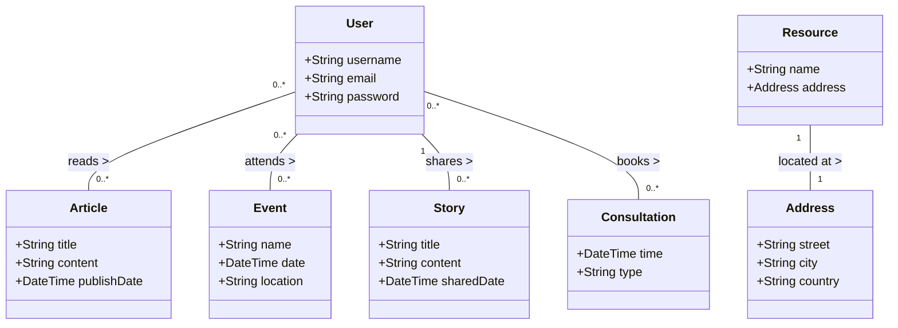

# HIV/AIDS Awareness and Support Platform

### Overview
The HIV/AIDS Awareness and Support Platform is a comprehensive digital solution aimed at enhancing knowledge, fostering community engagement, and providing resources and support for individuals affected by HIV/AIDS. This platform serves as a centralized hub for education, support services, and community stories, contributing significantly to the global effort in HIV/AIDS awareness and treatment.

### Features  
- User Authentication and Management: Allows users to register, login, and update their profiles.

- Articles and Educational Content Management: Users can access a wide range of articles related to HIV/AIDS prevention, treatment, and latest research findings. The platform enables content creation, modification, and deletion, promoting knowledge sharing among users.

- User Story Sharing: Another kind of article. A space for users to share their personal stories and experiences with HIV/AIDS, fostering a sense of community and mutual support.

- Event Management and User Participation: Facilitates the creation and management of events aimed at HIV/AIDS awareness. Users can find events, register their participation, and access event details, enhancing community involvement and support.

- Resource and Consultation Services: Provides a way of finding resources such as testing centers and treatment facilities. This feature aims to make healthcare services more accessible to users.

### Domain-Driven Design (DDD) Model Description
The platform is designed around a Domain-Driven Design (DDD) model that encapsulates the complexity of dealing with HIV/AIDS awareness and support. The model consists of several key entities and relationships:

- User: Represents individuals using the platform, with attributes such as username, email, password, and role to differentiate between patient, doctor, and general user.

- Article: Contains educational content, with attributes for the title, content, and publication date.

- Story: Another kind of atricle. Allows users to share their personal journeys and experiences, featuring a title, narrative, and shared date.

- Event: Manages awareness events, with details including name, date, and location.

- Resource: Represents external resources available for users, linked to an Address entity for location details.

- Address: Provides detailed location information for resources, including street, city, and country.

### Relationships 
- Articles and Treatment: Articles can discuss one or more treatments, showing a direct relationship between educational content and specific HIV/AIDS treatments.

- Users and Various Entities: Users can interact with multiple entities within the platform:

  - Read multiple articles.
  - Share multiple stories.
  - Attend multiple events.
- Resource and Address: Each resource is associated with a specific address, indicating the physical or online location.

This DDD model facilitates the development and future scaling of the platform by clearly defining the core domain concepts and their interrelations, thus providing a solid foundation for implementing the described features.

## Email Contact
Zenan Fan fan.zen@northeastern.edu  
Yinhao Zhao zhao.yinh@northeastern.edu  
Ting Guo guo.ting1@northeastern.edu  
Zuyi Huang huang.zu@northeastern.edu

## Object Model

